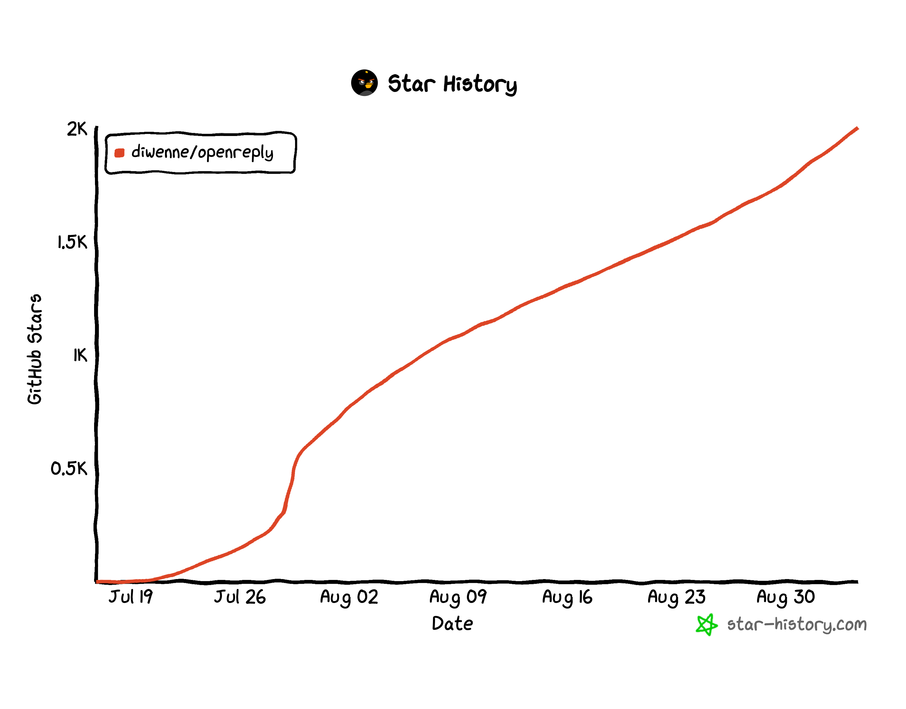

# Diwen Huang

Rising senior at Port Moody Secondary.

Builder of [Smashspeed](https://smashspeed.ca) — badminton speed tracker, 57,000+ users, #1 on App Store Sports. Creator of [Freakysaur](https://haocuii.itch.io/steve-the-freakysaur), winner of [Daydream](https://daydream.hackclub.com) (250K+ impressions). Founding engineer at [Solace](https://solacelaunch.com) (UC Berkeley + [Virtuals Protocol](https://virtuals.io)). Intern at [Clutch](https://clutchapp.io). Shipped [OpenReply](https://github.com/diwenne/openreply) and attended [YC Startup School](https://events.ycombinator.com/startup-school-2026).

---

## OpenReply

Maintainer of [OpenReply](https://github.com/diwenne/openreply) — open-source ManyChat alternative for Instagram comment-to-DM automation. Self-hosted, free.

---

## Links

- Website: [diwen.dev](https://diwen.dev) / [diwenhuang.ca](https://diwenhuang.ca)
- GitHub: [@diwenne](https://github.com/diwenne)
- X: [@diwennee](https://x.com/diwennee)
- Instagram: [@devdiwen](https://instagram.com/devdiwen)
